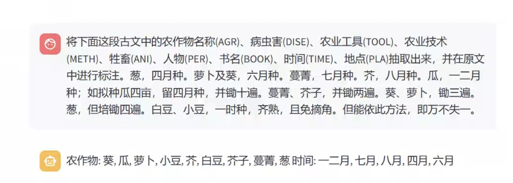
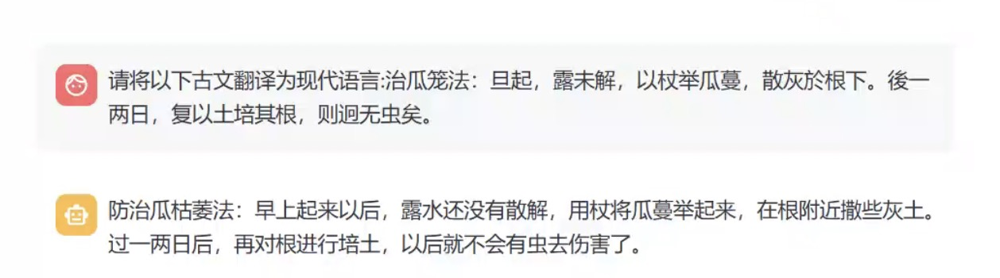

# Ancient-Agri-LLM
### Ancient-Agri-LLM：基于古代农业知识的GLM微调模型
为推动大语言模型在古农文领域的发展和落地，提升大模型在面向农业古籍知识智能处理与服务的能力，本项目现推出**Ancient-Agri-LLM**古农文领域大模型。

### 简介 Brief Introduction
**Ancient-Agri-LLM**是首个专注于古农文领域应用的大语言模型，在通用模型[GLM-4-9B](https://github.com/THUDM/GLM-4)的基础上，通过收集和处理农业古籍的全文语料，构建了适配古农文领域任务的指令微调数据集，并完成了相应的微调训练。本模型具备古农文信息抽取、翻译等功能，能够为农史研究者、农业学者及汉语语言学者提供强大的研究支持。

### 功能演示 Capabilities Demo
* 古农文信息抽取：自动从古农文中抽取出古农实体信息，如农作物、农具、牲畜、病虫害和农业技术方法等


* 古农文翻译：对于晦涩难理解的古农文提供翻译服务，使研究者更好地理解全文




### 使用方法 Model Usage

#### 模型下载
本项目仅提供微调后的LORA权重文件。[模型下载](https://github.com/AgBigdataLab/Ancient-Agri-LLM/tree/main/gunong_lora)
#### 模型调用
```python
from transformers import AutoModelForCausalLM, AutoTokenizer
import torch
from peft import PeftModel

MODEL_PATH = "THUDM/glm-4-9b-chat"
lora_path = './gunong_lora'
# 加载tokenizer
tokenizer = AutoTokenizer.from_pretrained(MODEL_PATH, trust_remote_code=True)
# 加载模型
model = AutoModelForCausalLM.from_pretrained(MODEL_PATH, device_map="auto",torch_dtype=torch.bfloat16, trust_remote_code=True).eval()
# 加载lora权重
model = PeftModel.from_pretrained(model, model_id=lora_path)

prompt = "将下面这段古文中的农作物名称(AGR)、病虫害(DISE)、农业工具(TOOL)、农业技术(METH)、牲畜(ANI)、人物(PER)、书名(BOOK)、时间(TIME)、地点(PLA)抽取出来，并在原文中进行标注。\n"
inputs = tokenizer.apply_chat_template([{"role": "user", "content": prompt+text}],
                                    add_generation_prompt=True,
                                    tokenize=True,
                                    return_tensors="pt",
                                    return_dict=True
                                    ).to('cuda')

gen_kwargs = {"max_length": 521, "do_sample": False}
with torch.no_grad():
    outputs = model.generate(**inputs, **gen_kwargs)
    outputs = outputs[:, inputs['input_ids'].shape[1]:]
    response = tokenizer.decode(outputs[0], skip_special_tokens=True)
    print(response)
```


### 声明 Disclaimers
- 本项目模型资源仅供学术研究之用，严禁用于商业用途；
- 本项目模型生成内容受模型计算、随机性和量化精度损失等因素影响，无法对其准确性作出保证；
- 本项目不承担任何法律责任，亦不对因使用相关资源和输出结果而可能产生的任何损失承担责任。

我们欢迎与业界人士的交流与合作，如有数据集提供或者合作事宜，请与我们进行联系。
